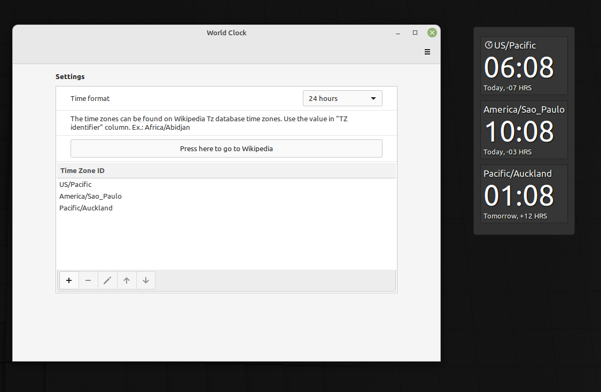

# World Clock

This is a digital clock desklet that supports multiple clocks based on time zone
for the Linux desktop environment Cinnamon (https://github.com/linuxmint/Cinnamon).

## Development

Before starting developing, make sure to run `make dev-prepare` to install libs that are not required, but
improves the development experience, like [ESlint](https://eslint.org) and [Prettier](https://prettier.io/).
If you're using vscode, the tools will be enabled as soon as the recommended extesion are installed.  
To check for any lint or code style issue, run `make inspect`.
Note: `dev-prepare` will create a symbolic link to desklet folder. The desklet manager can't delete it normally.
Use `make uninstall` or delete the symbolic link, to uninstall the desklet.

## Translations

Run `make generate-pot` to generate the `po/worldclock@emilio2hd`. Make sure to remove `node_module` before running it.

Use [poedit](https://poedit.net/) and create a new `po` file based on the file generated by the `make` command.

Run `make install-po` to install the translation files.

## References

- https://projects.linuxmint.com/reference/git/cinnamon-tutorials
- https://gjs.guide/guides
- https://github.com/linuxmint/cinnamon/tree/master/js/ui
- https://github.com/linuxmint/cinnamon-spices-desklets
- https://gjs-docs.gnome.org/
